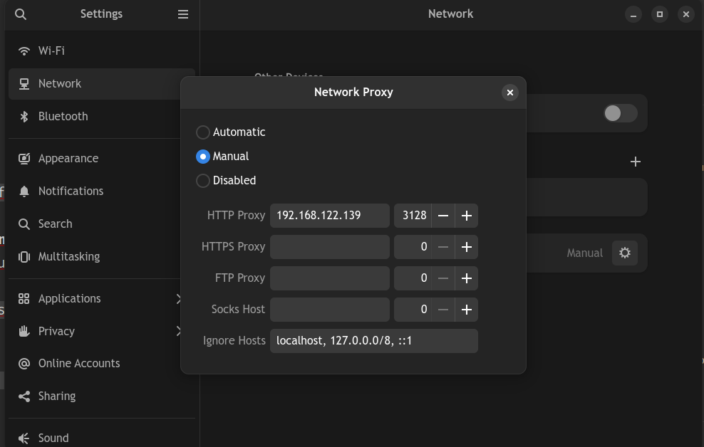
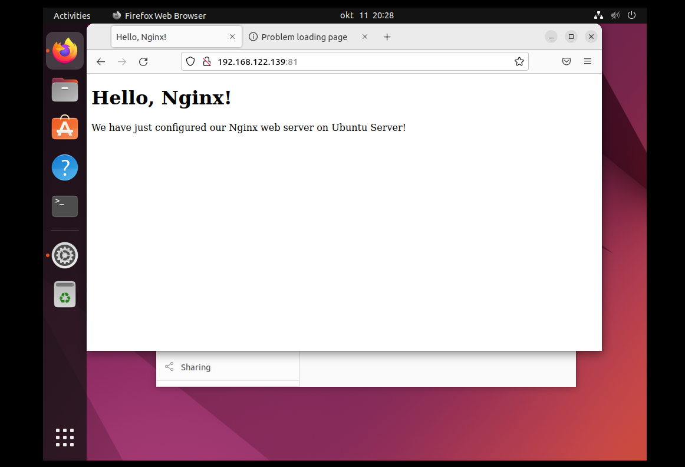
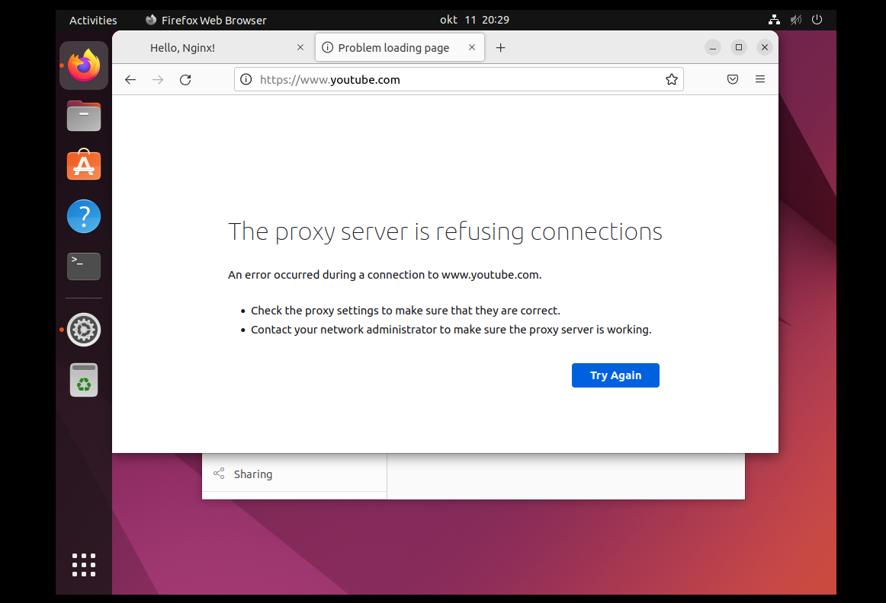
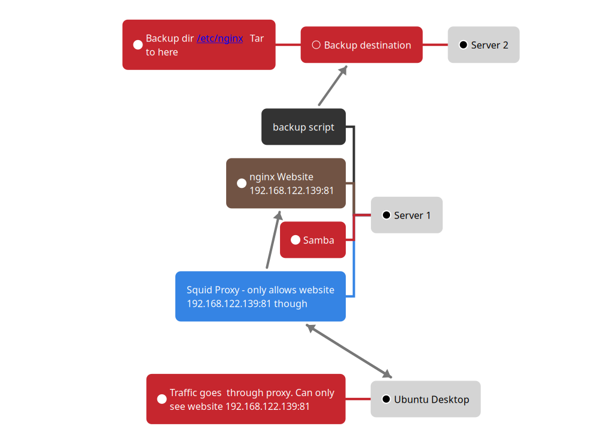

## 1. Virtuaalmasinate tegemine

### 1.1 ISO failide saamine
Laen alla Ubuntu veebilehelt:<br/>
[Ubuntu Server 20.04](https://ubuntu.com/download/server)<br/>
[Ubuntu Desktop 22.04](https://ubuntu.com/download/desktop/thank-you?version=22.04.1&architecture=amd64)


###  1.2 Virtuaalmasinate paigaldamine
Teen 3 virtuaalmasinat (2 serverit ja 1 desktop) omal vabalt valitud virtuaalmasina tarkvaraga.
Mina valisin selleks tarkvaraks virt-manager.
Andsin srveritele 1 tuum, 1024MB RAM ja 10GB kettaruumi ja
töölauaga masinale 2 tuuma 4096MB RAM ja 35 GB kettaruumi


###  1.3 Paigaldan OP süsteemid
Vali Installerist kõik väikesätted peale klaviatuuri, mis peab olema eesti keeles ja apt mirror, mis peaks olema us mirror.


### 1.4 Uuendan kõik virtuaalmasinad käsuga:
`sudo apt update && sudo apt upgrade`


## 2. Server 1 (ilma töölauata)


### 2.1 SSH
Luban ssh tulemüürist läbi:  
`sudo ufw allow ssh && sudo ufw enable`


### 2.2 Nginx Veebileht


#### 2.2.1 Paigaldan nginx
`sudo apt install nginx`


#### 2.2.2 Luban nginx läbi tulemüüri:
`sudo ufw allow ‘Nginx FULL’`


#### 2.2.3 Käivitan nginx-i
`sudo systemctl start nginx && sudo systemctl enable nginx`


#### 2.2.4 Teen Kausta, kus veebileht tuleb:
`sudo mkdir /var/www/tutorial`


#### 2.2.5 Teen veebilehe faili:
`sudo nano /var/www/tutorial/index.html` 


#### 2.2.6 index.html Faili Sisu
Kleepisin järgneva faili index.html:
```
<!doctype html> 
<html> 
<head> 
    <meta charset="utf-8"> 
    <title>Hello, Nginx!</title> 
</head> 
<body> 
    <h1>Hello, Nginx!</h1> 
    <p>We have just configured our Nginx web server on Ubuntu Server!</p> 
</body> 
</html> 
```


#### 2.2.7 Tutorial Faili Tegemine
Tegin faili tutorial
`sudo nano /etc/nginx/sites-enabled/tutorial`  


#### 2.2.8 Tutorial Faili Sisu
Kleepisin järgneva faili tutorial:
```
server { 
       listen 81; 
       listen [::]:81; 

       server_name example.com www.example.com; 

       root /var/www/tutorial; 
       index index.html; 

       location / { 
               try_files $uri $uri/ =404; 
       } 
}
```


#### 2.2.9 Teenuse taaskäivitus
Taaskäivitan nginx teenuse:  
`sudo service nginx restart `


#### 2.2.10 Tulemüür
Luban veebilehe tulemüüris läbi:  
`sudo ufw allow 81 && sudo ufw allow 80`


#### 2.2.11 Testimine
Panen serveri ip enda browserisse `ip:81`  
example: `192.168.122.139:81`  
<br/>
Tulemus peaks nägema välja selliselt:


###    2.3 Proxy teenus


####    2.3.1 Paigaldan squid pakendi: 
`sudo apt install squid`


####    2.3.2 Muudan conf faili:
Kleepisin järgneva faili squid.conf peale rida: `include /etc/squid/conf.d/*`
```
acl localnet src 192.168.122.109  # Ubuntu desktop IP 
acl GOOD dst 192.168.122.139 # Website IP 
http_access allow GOOD 
http_access deny all 
acl Safe_ports port 80 # Ports for nginx 
acl Safe_ports port 81
```


####    2.3.3 Käivitan proxy teenuse:
`sudo systemctl start squid && sudo systemctl enable squid`


###    2.4 Samba


####    2.4.1 Paigaldan Samba pakendi
`sudo apt install samba`


####    2.4.3 Avan samba conf faili
`sudo nano /etc/samba/smb.conf`


####    2.4.4 Lisan samba conf faili
Kleepisin järgneva faili smb.conf lõppu:
```
[Public]
    path = /home/sambapublicshare
    comment = Citizix Samba Shares
    browsable =yes
    writable = yes
    guest ok = yes
    read only = no

[Private]
    path = /home/sambaprivateshare
    valid users = @private
    guest ok = no
    writable = yes
    browsable = yes
```


#### 2.4.5 Taaskäivitan Samba
`sudo service smbd restart`


#### 2.4.6 Luban Samba tulemüürist läbi
`sudo ufw allow samba`


###    2.5 Varundus Script


#### 2.5.1 Teen faili backup.sh
`sudo nano /root/backup.sh`


#### 2.5.2 backup.sh Faili sisu
Kleepisin järgneva faili backup.sh
```
#!/bin/bash

# Create archive filename.
day=$(date +%d)
time=$(date +%H-%M)
archive_file="$day-$time.tgz"

# Print start status message.
#echo "Backing up $backup_files to $dest/$archive_file"
date
echo "backing things up."
echo "backing things up.."
echo "backing things up..."


# Backup the files using tar.
tar zcvf - /etc/nginx | \
 sshpass -p "123" ssh -o StrictHostKeyChecking=no sysadmin@192.168.122.177 'cat > /home/backup/tarbackups/'$archive_file'.tar.gz'
# Print end status message.
echo
echo "Backup finished"
date
```
#### 2.5.3 backup.sh Faili Õigused
`sudo chmod +x /root/backup.sh`

#### 2.5.4 Automaatvarundus Cron Abiga
`crontab -e`


#### 2.5.5 Cron Faili Sisu
Kleepisin järgneva faili `crontab -e` lõppu:
`*/10 * * * *    /root/backup.sh >> /root/backup.log`


## 3. Server 2 (ilma töölauata)


### 3.1 SSH
Luban ssh tulemüürist läbi:
`sudo ufw allow ssh && sudo ufw enable`


### 3.2 Varundus asukoht


#### 3.2.1 Varundus asukoha tegemine
Tegin Backup ja tarbackups kaustad:  
`mkdir /home/backup`  
`mkdir /home/backup/tarbackups`


#### 3.2.2 Õigused
Muustin omanikku
`sudo chown sysadmin:sysadmin /home/backup/tarbackups`


## 4. Desktop


### 4.1 Proxy Paigaldamine
Settings->Network->Network Proxy  
Sealt valid Manual ja esimesse lahtrisse panen proxy serveri `ip` ja teise port `3128`


### 4.2 Lõpptulemus
Lõpptulemus peaks nägema selliselt:



## 5. Skeem

## Kasutatud allikad
[Nginx 1](https://www.digitalocean.com/community/tutorials/how-to-install-nginx-on-ubuntu-20-04)  
[Nginx 2](https://ubuntu.com/tutorials/install-and-configure-nginx#3-creating-our-own-website)  
[Squid](https://www.digitalocean.com/community/tutorials/how-to-set-up-squid-proxy-on-ubuntu-20-04)  
[Samba](https://ubuntu.com/tutorials/install-and-configure-samba#1-overview)