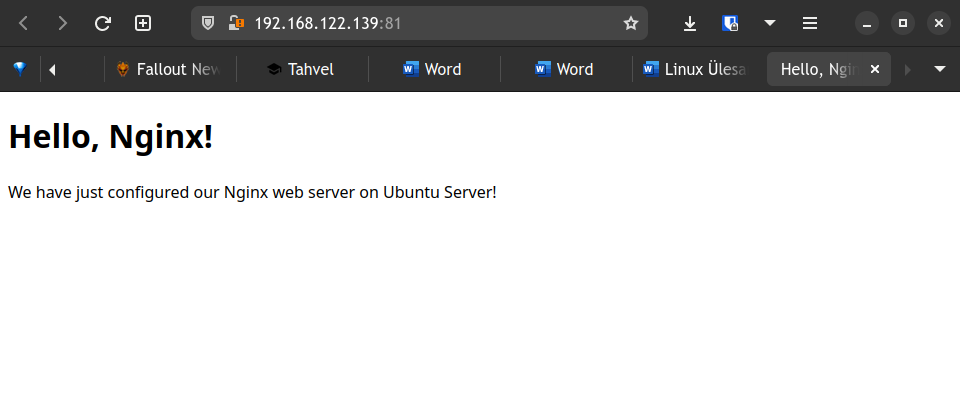

##    1. Virtuaalmasinate tegemine
⋅⋅* ISO failide saamine
Laen alla Ubuntu veebilehelt:
[Ubuntu 20.04 server](https://ubuntu.com/download/server)
 ja 
[Ubuntu desktop 22.04 ISO](https://ubuntu.com/download/desktop/thank-you?version=22.04.1&architecture=amd64)

####  1.2 Virtuaalmasinate paigaldamine
Teen 3 virtuaalmasinat (2 serverit ja 1 desktop) omal vabalt valitud virtuaalmasina tarkvaraga.
Mina valisin selleks tarkvaraks virt-manager.
Andsin srveritele 1 tuum, 1024MB RAM ja 10GB kettaruumi ja
töölauaga masinale 2 tuuma 4096MB RAM ja 35 GB kettaruumi
####  1.3 Paigaldan OP süsteemid
Seda saab lihtsalt teha ning, kuid seda pead ise uurima,
####		1.4 Uuendan kõik virtuaalmasinad käsuga:
`sudo apt update && sudo apt upgrade`

##    2. Server 1 (ilma töölauata)
####    2.1 SSH
Luban ssh tulemüürist läbi:
`sudo ufw allow ssh && sudo ufw enable`
####    2.2 Nginx Veebileht
#####    2.2.1 Paigaldan nginx
`sudo apt install nginx`
#####    2.2.2 Luban nginx läbi tulemüüri:
`sudo ufw allow ‘Nginx FULL’`
#####	2.2.3 Käivitan nginx-i
`sudo systemctl start nginx && sudo systemctl enable nginx`
#####	2.2.4 Teen Kausta, kus veebileht tuleb:
`sudo mkdir /var/www/tutorial`
#####	2.2.5 Teen veebilehe faili:
`sudo nano /var/www/tutorial/index.html` 
#####	2.2.6 Lisan faili sisse jägmise:

`

<!doctype html> 

<html> 

<head> 

    <meta charset="utf-8"> 

    <title>Hello, Nginx!</title> 

</head> 

<body> 

    <h1>Hello, Nginx!</h1> 

    
We have just configured our Nginx web server on Ubuntu Server!
 

</body> 

</html> 

`
  

`cd /etc/nginx/sites-enabled` 

`sudo nano tutorial`

`

server { 

       listen 81; 

       listen [::]:81; 

  

       server_name example.com www.example.com; 

  

       root /var/www/tutorial; 

       index index.html; 

  

       location / { 

               try_files $uri $uri/ =404; 

       } 

}

#####	2.2.7 Taaskäivitan nginx teenuse:
`sudo service nginx restart `
#####	2.2.8 Luban veebilehe tulemüüris läbi:
`sudo ufw allow 81, 80`
#####	2.2.9 Panen serveri ip enda browserisse
ip:81
example: 192.168.122.139:81
Tulemus peaks nägema välja selliselt:

#####    2.3 Proxy teenus 
#####    2.3.1 Paigaldan squid pakendi: 
`sudo apt install squid`
#####    2.3.2 Muudan conf faili:
Lisan järgmsised read peale rida `include /etc/squid/conf.d/* `
'acl localnet src 192.168.122.109  # Ubuntu desktop IP 
acl GOOD dst 192.168.122.139 # Website IP 
http_access allow GOOD 
http_access deny all 
acl Safe_ports port 80 # Ports for nginx 
acl Safe_ports port 81'
#####    2.3.3 Käivitan proxy teenuse:
`sudo systemctl start squid && sudo systemctl enable squid `
#####    2.3.4 *Lisan proxi ubuntu desktopile
Settings->Network->Network Proxy
Sealt valid Manual ja esimesse lahtrisse panen proxy serveri `ip` ja teise port `3128`
#####    2.4 Samba
#####    2.4.1 Paigaldan samba pakendi
`sudo apt install samba`

#####    2.4.3 Muudan samba conf faili
`sudo nano /etc/samba/smb.conf`
lisan faili lõppu
`[Public]
    path = /home/sambapublicshare
    comment = Citizix Samba Shares
    browsable =yes
    writable = yes
    guest ok = yes
    read only = no

[Private]
    path = /home/sambaprivateshare
    valid users = @private
    guest ok = no
    writable = yes
    browsable = yes`
#####	2.4.4 Taaskäivitan Samba
`sudo service smbd restart`
#####	2.4.5 Luban Samba tulemüürist läbi
`sudo ufw allow samba`
#####	2.3.9
#####	2.3.
#####	2.3.

##	3. Server 2 (ilma töölauata)
#####	3.1.1 SSH
Luban ssh tulemüürist läbi:
`sudo ufw allow ssh && sudo ufw enable`
